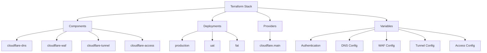
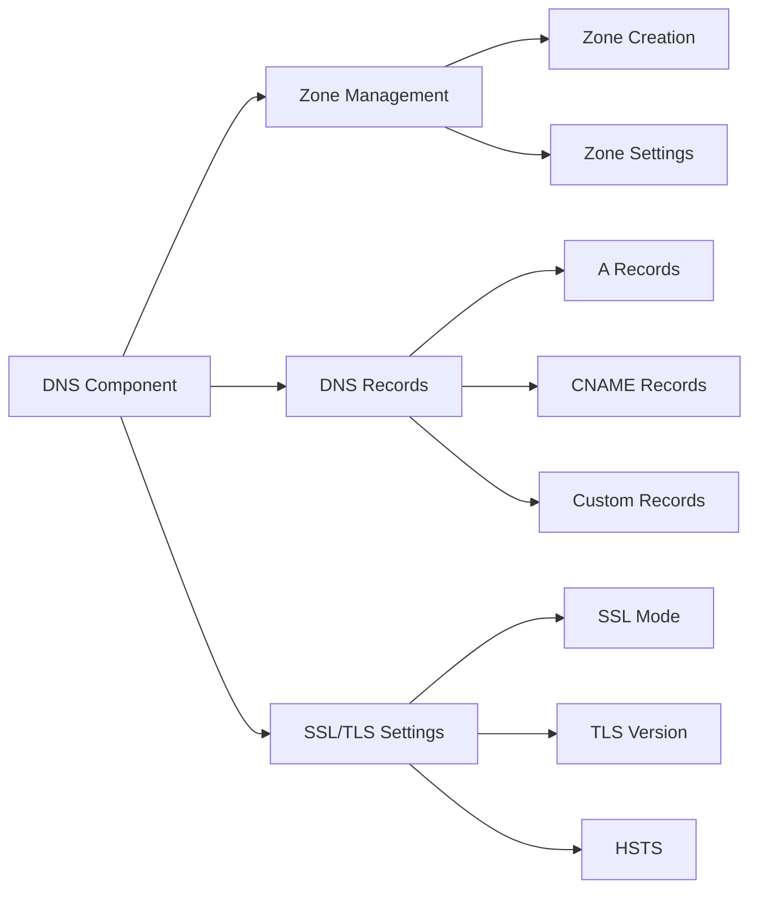
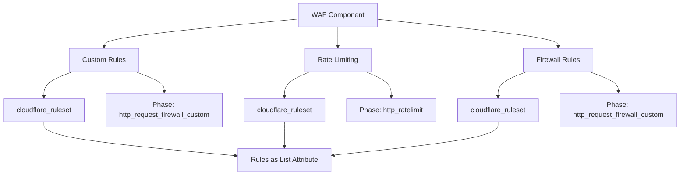
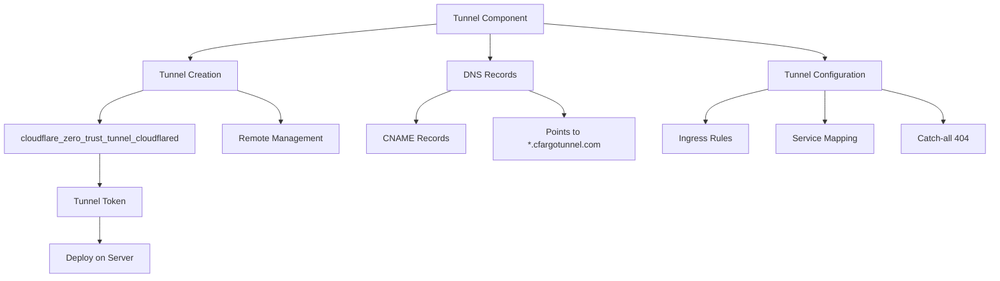
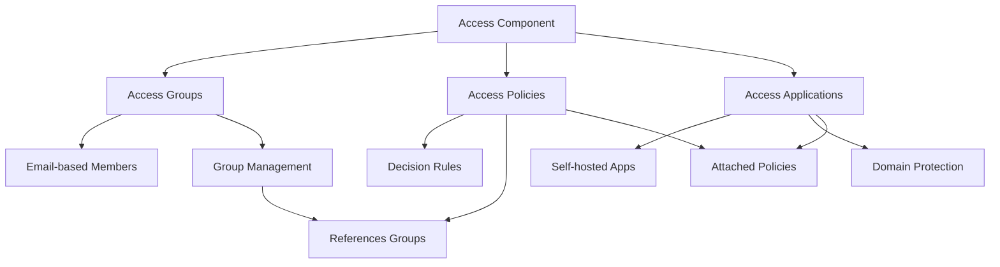
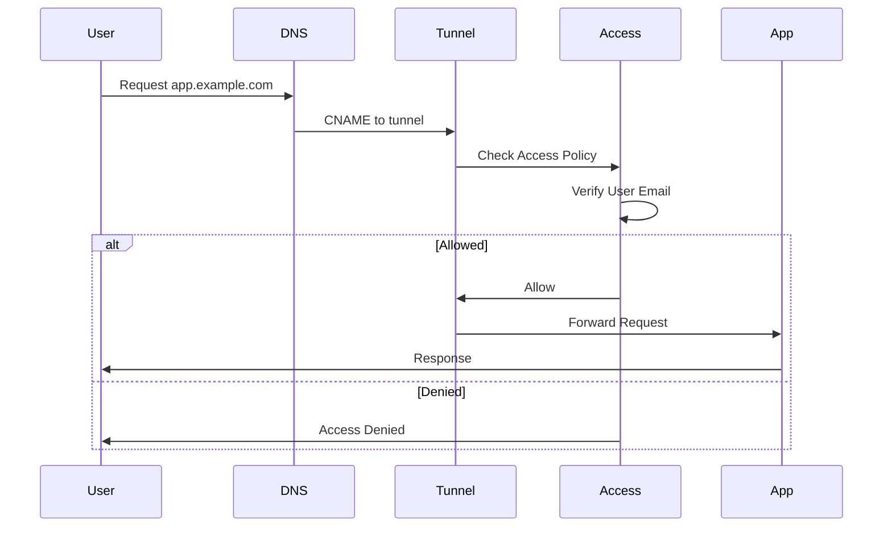
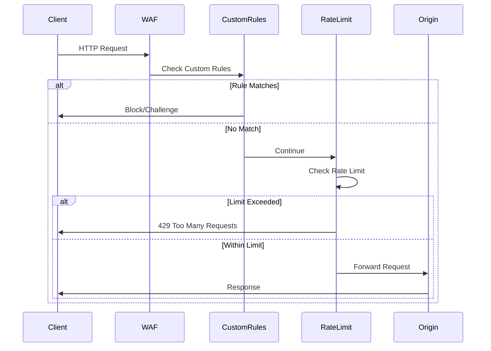
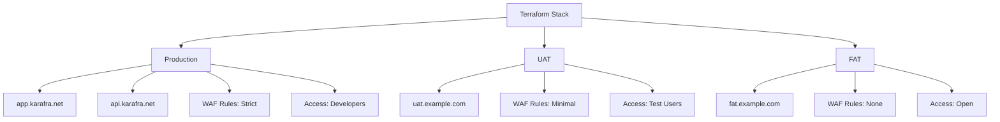
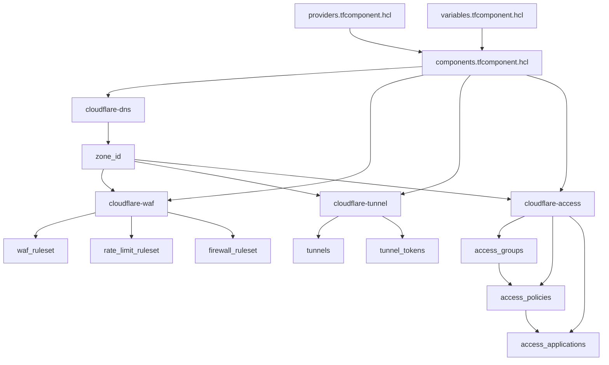

# Architecture Overview

## Introduction

This Terraform Stack manages Cloudflare infrastructure including DNS, WAF, Zero Trust Tunnels, and Access policies. The stack is designed to support multiple environments (production, UAT, FAT) with environment-specific configurations.

## Stack Structure

The project follows Terraform Stacks architecture pattern with the following key components:

- **Components**: Reusable infrastructure modules
- **Deployments**: Environment-specific configurations
- **Providers**: Cloudflare provider configuration
- **Variables**: Stack-level input variables



## Component Architecture

### DNS Component

Manages Cloudflare DNS zones and records with SSL/TLS configuration.



### WAF Component

Implements Web Application Firewall rules using Cloudflare Rulesets.



### Tunnel Component

Manages Cloudflare Zero Trust Tunnels for secure application access.



### Access Component

Implements Zero Trust Access policies for application protection.



## Data Flow

### Request Flow with Zero Trust



### WAF Protection Flow



## Deployment Architecture

### Multi-Environment Setup



## Resource Dependencies



## Component Inputs and Outputs

### DNS Component

**Inputs:**
- account_id
- domain
- plan
- ssl_mode
- tls_version
- hsts_settings

**Outputs:**
- zone_id
- zone_name
- name_servers

### WAF Component

**Inputs:**
- zone_id
- name_suffix
- custom_rules
- rate_limits
- firewall_rules

**Outputs:**
- ruleset_id
- waf_ruleset_id
- rate_limit_ruleset_id
- firewall_ruleset_id

### Tunnel Component

**Inputs:**
- account_id
- zone_id
- name_suffix
- tunnels (map)

**Outputs:**
- tunnel_ids
- tunnel_tokens (sensitive)
- tunnel_cnames

### Access Component

**Inputs:**
- account_id
- zone_id
- name_suffix
- access_groups
- access_applications
- access_policies

**Outputs:**
- access_group_ids
- access_application_ids
- access_policy_ids

## Security Considerations

### Authentication

All authentication variables are marked as sensitive and ephemeral:
- cloudflare_api_token
- cloudflare_email
- cloudflare_account_id

These should be provided via:
- Terraform Cloud variables
- Environment variables (TFC_VAR_*)
- Secure credential stores

### Zero Trust Architecture

The stack implements Zero Trust principles:
1. All traffic goes through Cloudflare Tunnel
2. No direct exposure of origin servers
3. Access policies enforce authentication
4. Email-based group membership
5. Session duration limits

### WAF Protection

Multiple layers of protection:
1. Custom firewall rules
2. Rate limiting by IP/endpoint
3. Threat score evaluation
4. Bot management
5. Geographic restrictions (optional)

## Naming Conventions

Resources follow consistent naming patterns:

```
{resource_key}-{environment}
```

Examples:
- `app-prod` (tunnel)
- `developers-prod` (access group)
- `Custom WAF Rules - prod` (ruleset)

## Module Structure

Each module follows standard Terraform structure:

```
modules/{module-name}/
├── main.tf         # Resource definitions
├── variables.tf    # Input variables
└── outputs.tf      # Output values
```

## Best Practices

1. **Environment Isolation**: Each deployment is independent
2. **DRY Principle**: Shared logic in components, config in deployments
3. **Sensitive Data**: Never commit secrets to version control
4. **Variable Defaults**: Sensible defaults for optional parameters
5. **Resource Naming**: Consistent naming with environment suffix
6. **Documentation**: Keep docs updated with infrastructure changes

## Troubleshooting

### Common Issues

**Provider Authentication Errors**
- Verify API token has required permissions
- Check account_id is correct
- Ensure token is not expired

**Tunnel Connection Issues**
- Verify tunnel token is correctly deployed
- Check cloudflared service is running
- Validate ingress rules configuration

**Access Policy Conflicts**
- Check policy precedence ordering
- Verify group membership
- Review decision logic (allow/deny)

**WAF False Positives**
- Review custom rule expressions
- Adjust rate limit thresholds
- Use challenge instead of block for testing

