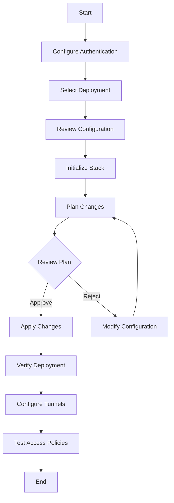
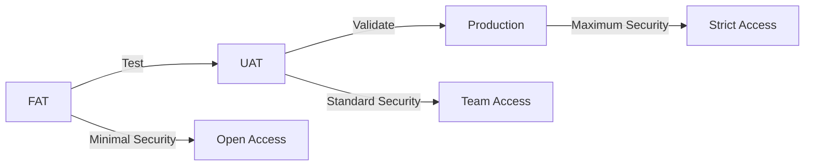

# Deployment Guide

## Prerequisites

1. Terraform 1.7.0 or later with Stacks support
2. Cloudflare account with appropriate permissions
3. Cloudflare API token with the following permissions:
   - Account.Cloudflare Tunnel - Edit
   - Account.Access: Apps and Policies - Edit
   - Account.Access: Organizations, Identity Providers, and Groups - Edit
   - Zone.DNS - Edit
   - Zone.Zone - Edit
   - Zone.Zone Settings - Edit
   - Zone.Firewall Services - Edit
4. Cloudflare account ID and zone ID

## Authentication Setup

### Option 1: Terraform Cloud Variables

Set the following variables in Terraform Cloud:

```
TFC_VAR_cloudflare_api_token  = "your-api-token"
TFC_VAR_cloudflare_email      = "your-email@example.com"
TFC_VAR_cloudflare_account_id = "your-account-id"
```

### Option 2: Environment Variables

```bash
export TF_VAR_cloudflare_api_token="your-api-token"
export TF_VAR_cloudflare_email="your-email@example.com"
export TF_VAR_cloudflare_account_id="your-account-id"
```

### Option 3: tfvars File (Not Recommended for Production)

Create `terraform.tfvars`:

```hcl
cloudflare_api_token  = "your-api-token"
cloudflare_email      = "your-email@example.com"
cloudflare_account_id = "your-account-id"
```

**Warning:** Never commit this file to version control.

## Deployment Workflow



## Step-by-Step Deployment

### Step 1: Initialize the Stack

```bash
cd /path/to/infra-cloudflare
terraform init
```

This will:
- Download the Cloudflare provider
- Initialize the backend
- Validate stack configuration

### Step 2: Select Deployment

Choose which deployment to work with:

```bash
# Production
terraform workspace select production

# UAT
terraform workspace select uat

# FAT
terraform workspace select fat
```

### Step 3: Plan Changes

Review what Terraform will create:

```bash
terraform plan
```

Expected output includes:
- DNS zone creation
- DNS records
- WAF rulesets
- Cloudflare Tunnels
- Access groups, policies, and applications

### Step 4: Apply Changes

Deploy the infrastructure:

```bash
terraform apply
```

Review the plan and type `yes` to confirm.

### Step 5: Retrieve Tunnel Tokens

After deployment, retrieve tunnel tokens:

```bash
terraform output -json tunnel_tokens
```

Save these tokens securely for tunnel deployment.

## Configuring Tunnels

### Install cloudflared

**Linux:**
```bash
curl -L https://github.com/cloudflare/cloudflared/releases/latest/download/cloudflared-linux-amd64 -o /usr/local/bin/cloudflared
chmod +x /usr/local/bin/cloudflared
```

**macOS:**
```bash
brew install cloudflare/cloudflare/cloudflared
```

**Docker:**
```bash
docker pull cloudflare/cloudflared:latest
```

### Run Tunnel

**Using Token:**
```bash
cloudflared tunnel run --token <TUNNEL_TOKEN>
```

**As systemd Service:**

Create `/etc/systemd/system/cloudflared.service`:

```ini
[Unit]
Description=Cloudflare Tunnel
After=network.target

[Service]
Type=simple
User=cloudflared
ExecStart=/usr/local/bin/cloudflared tunnel run --token <TUNNEL_TOKEN>
Restart=on-failure
RestartSec=5s

[Install]
WantedBy=multi-user.target
```

Enable and start:
```bash
sudo systemctl enable cloudflared
sudo systemctl start cloudflared
sudo systemctl status cloudflared
```

**Docker Compose:**

```yaml
version: '3.8'
services:
  cloudflared:
    image: cloudflare/cloudflared:latest
    command: tunnel run --token <TUNNEL_TOKEN>
    restart: unless-stopped
```

### Verify Tunnel Connection

```bash
# Check tunnel status
cloudflared tunnel list

# Check tunnel info
cloudflared tunnel info <TUNNEL_ID>

# View logs
journalctl -u cloudflared -f
```

## Testing Access Policies

### Test Authentication Flow

1. Navigate to protected domain (e.g., `https://app.karafra.net`)
2. You should see Cloudflare Access login page
3. Enter email address from access group
4. Check email for one-time PIN
5. Enter PIN to complete authentication
6. Verify redirect to application

### Test Unauthorized Access

1. Navigate to protected domain with unauthorized email
2. Attempt authentication
3. Verify access denied message

### Verify Session Duration

1. Authenticate successfully
2. Close browser
3. Wait for session duration to expire
4. Attempt to access application
5. Verify re-authentication required

## Updating Deployments

### Modify Configuration

Edit `deployments.tfdeploy.hcl`:

```hcl
deployment "production" {
  inputs = {
    # Update values
    domain = "new-domain.com"
    
    # Add new WAF rules
    waf_custom_rules = [
      {
        action      = "block"
        expression  = "(cf.threat_score gt 80)"
        description = "Block high threat traffic"
        enabled     = true
      }
    ]
  }
}
```

### Apply Changes

```bash
terraform plan
terraform apply
```

## Rollback Procedure

### Using Terraform State

```bash
# View state history
terraform state list

# Show specific resource
terraform state show cloudflare_zone.main

# Remove problematic resource
terraform state rm cloudflare_ruleset.waf_custom_rules[0]

# Re-import
terraform import cloudflare_ruleset.waf_custom_rules[0] <ruleset-id>
```

### Using Version Control

```bash
# Revert to previous commit
git revert HEAD
git push

# Run plan and apply
terraform plan
terraform apply
```

## Monitoring

### DNS Health Checks

```bash
# Check zone status
dig @1.1.1.1 example.com NS

# Verify DNS propagation
dig @8.8.8.8 app.example.com
```

### Tunnel Health

```bash
# Check tunnel connectivity
curl -I https://app.example.com

# View tunnel metrics in dashboard
# Navigate to: Cloudflare Dashboard > Zero Trust > Access > Tunnels
```

### WAF Monitoring

View WAF activity:
1. Navigate to Cloudflare Dashboard
2. Select zone
3. Go to Security > WAF
4. Review Activity Log

### Access Logs

View authentication logs:
1. Navigate to Cloudflare Dashboard
2. Go to Zero Trust > Logs > Access
3. Filter by application or user

## Troubleshooting

### Issue: Provider Authentication Failed

**Symptoms:**
```
Error: failed to verify API token: Invalid request headers
```

**Resolution:**
1. Verify API token is valid
2. Check token permissions
3. Ensure token is not expired
4. Validate account_id is correct

### Issue: Tunnel Connection Failed

**Symptoms:**
```
Failed to connect to Cloudflare edge
```

**Resolution:**
1. Verify tunnel token is correct
2. Check network connectivity
3. Ensure cloudflared is latest version
4. Review firewall rules (allow outbound 7844)
5. Check cloudflared logs

### Issue: Access Policy Not Working

**Symptoms:**
- Users can't authenticate
- Unauthorized users getting access

**Resolution:**
1. Verify group membership
2. Check policy precedence
3. Review decision logic
4. Validate application domain matches
5. Clear browser cookies

### Issue: WAF Blocking Legitimate Traffic

**Symptoms:**
```
403 Forbidden
```

**Resolution:**
1. Review WAF activity log
2. Identify blocking rule
3. Adjust rule expression
4. Use "challenge" instead of "block" temporarily
5. Whitelist specific IPs if needed

### Issue: DNS Not Resolving

**Symptoms:**
```
NXDOMAIN
```

**Resolution:**
1. Verify nameservers updated at registrar
2. Check DNS propagation (dig/nslookup)
3. Verify zone is active in Cloudflare
4. Check DNS records created correctly
5. Wait for propagation (up to 48 hours)

## Performance Optimization

### DNS

- Enable DNSSEC for additional security
- Use short TTL during testing (60s)
- Increase TTL in production (300s+)
- Enable Cloudflare proxy for performance

### Tunnels

- Deploy cloudflared close to origin
- Use HTTP/2 for better performance
- Enable compression in application
- Monitor tunnel metrics

### WAF

- Place most specific rules first
- Use "log" action during testing
- Review and prune unused rules
- Monitor false positive rate

### Access

- Set appropriate session duration
- Use device posture checks for security
- Enable caching where possible
- Monitor authentication latency

## Security Best Practices

### API Token Management

- Rotate tokens regularly (90 days)
- Use least privilege permissions
- Store tokens in secure credential store
- Never commit tokens to version control
- Audit token usage regularly

### Tunnel Security

- Use unique secrets per tunnel
- Rotate tunnel credentials quarterly
- Monitor tunnel access logs
- Implement rate limiting on origin
- Use Access policies for all tunnels

### Access Policies

- Follow principle of least privilege
- Review group membership monthly
- Set short session durations for sensitive apps
- Enable MFA for high-security applications
- Audit access logs regularly

### WAF Configuration

- Start with "log" action
- Graduate to "challenge" then "block"
- Review blocked requests weekly
- Update rules based on threat intelligence
- Document all custom rules

## Maintenance Schedule

### Daily
- Monitor tunnel health
- Review access logs for anomalies
- Check WAF block rates

### Weekly
- Review WAF activity logs
- Audit blocked requests
- Check for false positives

### Monthly
- Review and update access groups
- Audit user access patterns
- Update WAF rules based on threats
- Review session durations

### Quarterly
- Rotate API tokens
- Rotate tunnel secrets
- Review all access policies
- Audit security configurations
- Update documentation

## Disaster Recovery

### Backup Configuration

```bash
# Export current state
terraform show -json > backup-$(date +%Y%m%d).json

# Backup tfstate
cp terraform.tfstate terraform.tfstate.backup
```

### Recovery Procedure

1. Initialize new workspace
2. Import existing resources
3. Restore from backup state
4. Validate configuration
5. Apply missing resources

### Import Existing Resources

```bash
# Import zone
terraform import 'component.cloudflare_dns.cloudflare_zone.main' <zone-id>

# Import tunnel
terraform import 'component.cloudflare_tunnel.cloudflare_zero_trust_tunnel_cloudflared.tunnels["app"]' <tunnel-id>

# Import access group
terraform import 'component.cloudflare_access.cloudflare_zero_trust_access_group.groups["developers"]' <group-id>
```

## Multi-Environment Strategy

### Development Workflow



### Environment Differences

**FAT (Feature Acceptance Testing):**
- No WAF rules
- Open access policies
- Short session durations
- Verbose logging

**UAT (User Acceptance Testing):**
- Minimal WAF rules
- Team-only access
- Standard session durations
- Standard logging

**Production:**
- Full WAF protection
- Strict access policies
- Extended session durations
- Comprehensive monitoring

## Appendix

### Useful Commands

```bash
# List all resources
terraform state list

# Show resource details
terraform state show <resource>

# Refresh state
terraform refresh

# Validate configuration
terraform validate

# Format code
terraform fmt -recursive

# View outputs
terraform output

# Target specific resource
terraform apply -target=component.cloudflare_dns

# Destroy specific resource
terraform destroy -target=component.cloudflare_waf
```

### CloudFlare API Endpoints

- API Docs: https://developers.cloudflare.com/api/
- Zero Trust: https://developers.cloudflare.com/cloudflare-one/
- Tunnels: https://developers.cloudflare.com/cloudflare-one/connections/connect-apps/
- Access: https://developers.cloudflare.com/cloudflare-one/policies/access/

### Support Resources

- Terraform Stacks: https://developer.hashicorp.com/terraform/language/stacks
- Cloudflare Provider: https://registry.terraform.io/providers/cloudflare/cloudflare/latest/docs
- Cloudflare Community: https://community.cloudflare.com/
- Terraform Community: https://discuss.hashicorp.com/

